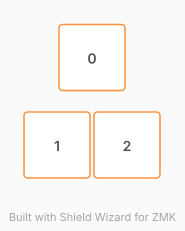

# ZMK Configuration for Page Turner

*Generated by Shield Wizard for ZMK*



Download compiled firmware from the Actions tab. <https://zmk.dev/docs/user-setup#installing-the-firmware>

Edit your keymap <https://zmk.dev/docs/keymaps>.
User keymap is located at [`config/page_turner.keymap`](config/page_turner.keymap).

-----

<details>
<summary>
Shield Wizard Debug Information
</summary>

In case of broken configuration, here is the Shield Wizard internal data used to generate this configuration:

Commit: 84a348b08cf4fec4a5441a46147e9a345b10ffab

```json
{"name":"Page Turner","shield":"page_turner","dongle":false,"modules":[],"layout":[{"id":"01M3FFRE86VZ030G77EK5JRTKB","part":0,"row":-1,"col":1,"w":1,"h":1,"x":1.5,"y":-1.25,"r":0,"rx":0,"ry":0},{"id":"01M3FFRFP06326C1VQGFX75VGY","part":0,"row":0,"col":1,"w":1,"h":1,"x":1,"y":0,"r":0,"rx":0,"ry":0},{"id":"01M3FFSKWCQCQY0HM9WYND5JBN","part":0,"row":0,"col":2,"w":1,"h":1,"x":2,"y":0,"r":0,"rx":0,"ry":0}],"parts":[{"name":"unibody","controller":"xiao_ble","pins":{"d0":{"usage":"kscan","kscan":"01M3FFTHPJB4PN63QDN79RN9QC","role":"input"},"d1":{"usage":"kscan","kscan":"01M3FFTHPJB4PN63QDN79RN9QC","role":"input"},"d2":{"usage":"kscan","kscan":"01M3FFTHPJB4PN63QDN79RN9QC","role":"input"}},"kscans":[{"kind":"direct","id":"01M3FFTHPJB4PN63QDN79RN9QC","mode":"gnd"}],"keys":{"01M3FFRE86VZ030G77EK5JRTKB":{"input":"d0"},"01M3FFRFP06326C1VQGFX75VGY":{"input":"d1"},"01M3FFSKWCQCQY0HM9WYND5JBN":{"input":"d2"}},"encoders":[],"buses":{}}]}
```

</details>
